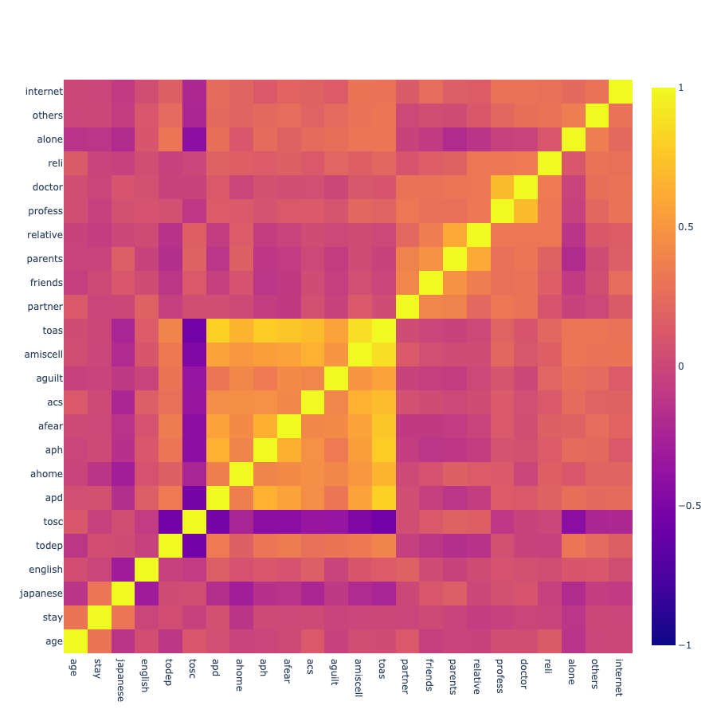
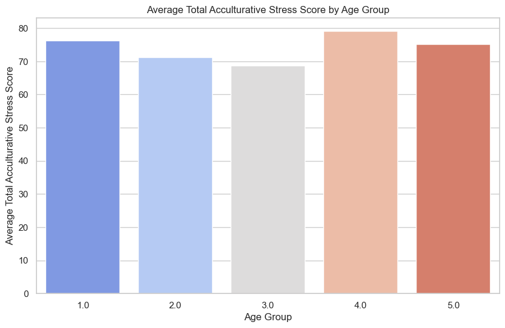
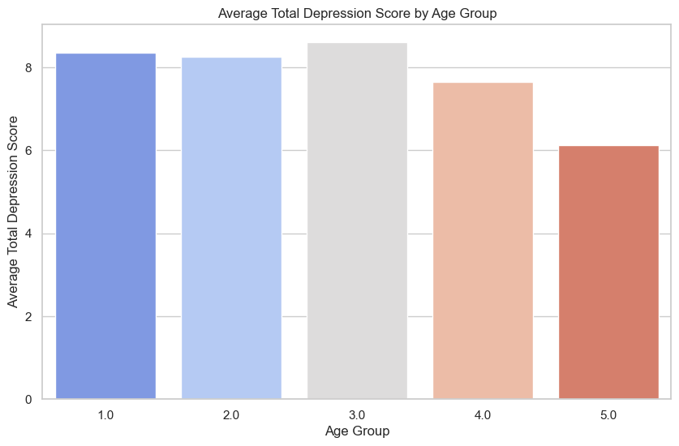
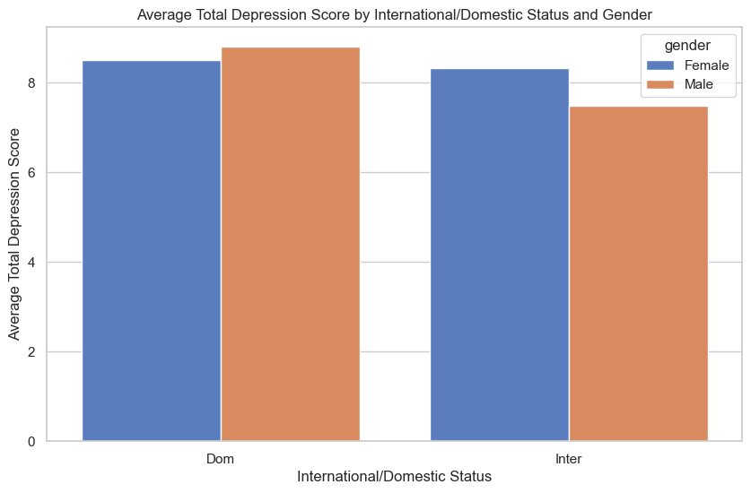
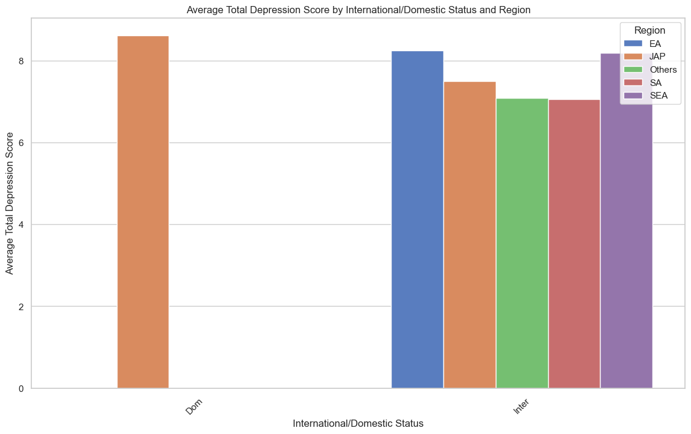
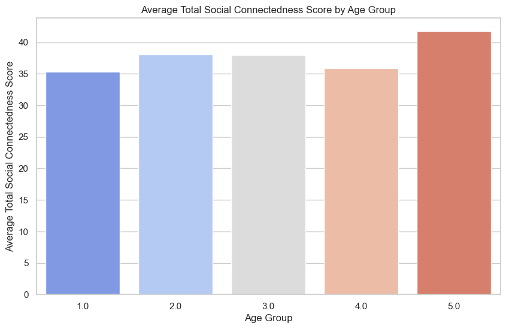

# International Student's Mental Health Analysis

## Overview
The project focuses on understanding the impact of studying abroad on students' mental health. Using a dataset from a study conducted by a Japanese international university in 2018, the analysis aims to explore the mental health challenges faced by international students. This dataset includes variables such as types of students (international or domestic), language proficiency, academic level, age, length of stay, total score of depression (PHQ-9 test), social connectedness (SCS test), and acculturative stress (ASISS test). The primary objectives are to investigate the relationship between social connectedness, acculturative stress, and depression among international students, and to examine if the length of stay or the student's age influences these mental health outcomes.

[See this paper for more information, including data description.](https://www.mdpi.com/2306-5729/4/3/124/htm)

[The dataset.](https://www.mdpi.com/2306-5729/4/3/124/s1)

## Data description
| Field Name    | Description                                      |
| ------------- | ------------------------------------------------ |
| `inter_dom`     | Types of students (international or domestic)   |
| `japanese_cate` | Japanese language proficiency                    |
| `english_cate`  | English language proficiency                     |
| `academic`      | Current academic level (undergraduate or graduate) |
| `age`           | Current age of student                           |
| `stay`          | Current length of stay in years                  |
| `todep`         | Total score of depression (PHQ-9 test)           |
| `tosc`          | Total score of social connectedness (SCS test)   |
| `toas`          | Total score of acculturative stress (ASISS test) |

## Data Visualization
Feature Correlation

### Average total acculturative stress score by age group

### Average total depression score by age group

### Average total depression score by international domestic status and gender

### Average total depression score by international domestic status and region

### Average total social connectedness score by age group

## Conclusion:
1) The analysis between international and domestic students suggests differences in mental health outcomes (e.g., depression scores) between the two groups. This could indicate that international students face unique challenges that affect their mental health differently compared to their domestic counterparts.
2) The visualization of depression scores by gender revealed potential disparities in how male and female students experience mental health issues. This highlights the importance of considering gender-specific approaches in mental health support and interventions.
3) The analysis based on students' regions showed variation in depression scores, suggesting that cultural background might influence students' mental health.
4) The examination of mental health scores and social connectedness across age groups provided insights into the varying needs and experiences of students at different stages of their academic and personal lives. Younger and older students may require different forms of support to address their specific challenges.

I hope you find this project useful. Please feel free to reach if you have any question or feedback.
